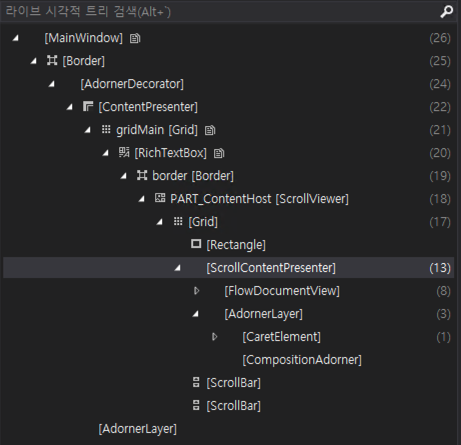

# WPFRichTextBoxEx
일본어 입력시 줄바꿈 처리

테스트 환경
- Visual Studio 2015
- .Net FrameWork 4.6
- WPF RichTextBox 사용

<<< 일본어 입력 줄바꿈시 현상 >>>

[일본어 입력시 단어 변환 팝업 생성]

[첫번째 입력 후 shift + enter 입력하여 줄바꿈 처리]

[두번째줄에서 일본어를 다시 입력하면 윗줄에 이어쓰기 되는 현상]

[실제 paragraph는 추가되었지만 글은 첫번째 줄로 일어진 현상]

>>> 해결 방안 <<<

1. WPF RichTextBox을 상속받은 새로운 RichTextBoxEx를 만든다.
2. 상속받은 컨트롤에서 PreviewKeyDown 이벤트를 받아 Shift + Enter 이벤트를 수동으로 처리한다.
3. Shift + Enter 처리시에 캐럿의 위치를 확인하여 그 뒤의 텍스트를 잘라서 생성한 Paragraph에 추가한 뒤에
   생성한 Paragraph를 현재 Paragraph 아래에 추가 한다.
4. 일본어를 입력하다가 Shift + Enter를 누를 경우에는 단어 변환기 팝업의 유무를 확인하여
   단어 변환기를 떠있지 않을 경우에만 Shift + Enter 이벤트를 처리한다.
5. 단어 변환기는 ComposiotionAdorner 클래스 이며 Adorner 클래스를 상속하였기 때문에
   AdornerLayer에서 확인할 수 있다. 
6. CompositionAdorner를 찾기 위해서는 비주얼 스튜디오의 라이브 시각적 트리 도구를 이용하여 확인 할수 있다.

[라이브 시각적 트리]

7. CompositionAdorner 클래스의 유무에 따라서 Shift + Enter 이벤트를 처리하면 된다.
